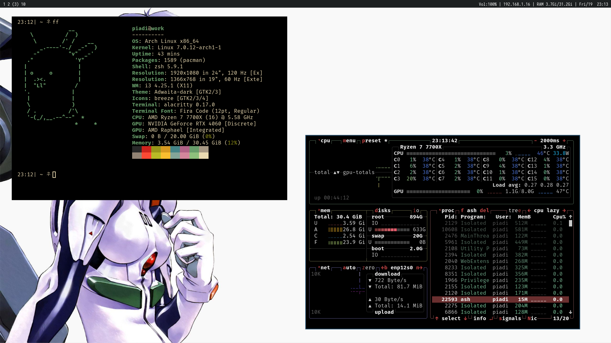

# ash
Ash is a simple x11 bar written in c,
designed to be used with i3-wm and to be forked.

Ash follows a compile-time configuration model (suckless-inspired).


### Dependencies
```text
- cmake
- libx11
- libxft
- fontconfig
- freetype2
- libxrender
```

### Structure

```text

└── src
    ├── bar.c
    ├── bar.h
    ├── config.h
    └── main.c

```
### Installation

First ensure all dependencies are installed.

```bash
git clone https://github.com/piadi-su/ash.git
cd ash
chmod +x installer.sh
./installer.sh

```

### Configuration

Ash is configured in the config.h,
follow the instuction in the comments and recompile.
Restart ash after rebuilding.




## License

Released under the MIT License.
